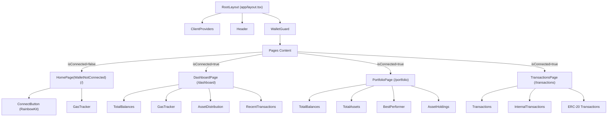

# Web3 Dashboard

A minimal Web3 portfolio tracker built with Next.js, wagmi, and RainbowKit.  
Connect your wallet to view your token balances and visualize your portfolio.

---

## Features

-  Connect Ethereum wallet
-  Display connected wallet address
-  Live Ethereum gas tracker (low / avg / high)
-  List ERC20 token balances (USDT, AVAX, USDC, etc)
-  Visualize token portfolio ratio as a pie chart
-  Recent 5 transactions summary (Transfer / Swap)
---

## Demo
[Live Link](https://web3-dashboard-pi.vercel.app/)
---

## Tech Stack

- Next.js
- TypeScript
- wagmi
- RainbowKit
- Viem
- Recharts
- Shadcn UI

---


## Component Structure


## Getting Started

1. Clone the repository:
```bash
git clone https://github.com/tlatjdgh3778/web3-dashboard.git
cd web3-dashboard
```

2. Install dependencies:
```bash
pnpm install
```

3. Set up environment variables:
```bash
cp .env.example .env.local
```
Edit `.env.local` and add your Alchemy API key and other required variables.

4. Run the development server:
```bash
pnpm run dev
```

5. Open [http://localhost:3000](http://localhost:3000) in your browser.

---
